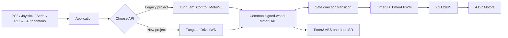
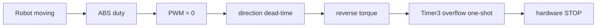

<div align="center">

# 🤖 TungLam_OmniMecanum_4WD

<p>
  <a href="README.md">🇻🇳 Tiếng Việt</a>
  •
  <a href="README.en.md">🌐 English</a>
</p>

### Hardware-timer motor control for Arduino Mega 2560 • Mecanum-X • Omni-X • Legacy V5 compatible

<p>
  <a href="https://github.com/Tunglam0605/TungLam-OmniMecanum-4WD/actions/workflows/compile-mega.yml">
    
  </a>
  <a href="https://github.com/Tunglam0605/TungLam-OmniMecanum-4WD/actions/workflows/arduino-lint.yml">
    
  </a>
  <a href="https://github.com/Tunglam0605/TungLam-OmniMecanum-4WD/actions/workflows/legacy-roboball-regression.yml">
    
  </a>
</p>

<p>
  
  
  
  
  
</p>

**Author:** Nguyễn Khắc Tùng Lâm • **Class:** DHTD16A2CL • **Tung Lâm Automation**

A compact Arduino library for 4-wheel holonomic robots using **hardware PWM**, a **shared safe motor HAL**, **Mecanum/Omni kinematics**, and **hardware-timed active reverse braking**.

</div>

---

## ✨ Why this library?

This project started from the original **TungLam_Control_MotorV5** that was already used on real RoboBall robots. The current library keeps the familiar V5 API while improving the internal architecture for safer direction changes, non-blocking braking, cleaner maintenance, and modern vector control.

### What you get

- ✅ Arduino Mega 2560 / ATmega2560 support
- ✅ 4 DC motors through **2× L298N**
- ✅ **Mecanum-X** control
- ✅ **Omni X-drive** control
- ✅ Signed wheel control `-255 ... +255`
- ✅ Standard right-handed body frame: `+X forward, +Y left, +Z/CCW yaw`
- ✅ SI velocity API: `vx/vy` in m/s and `wz` in rad/s
- ✅ Motor + chassis physical model: voltage, RPM, wheel radius, wheelbase, track width
- ✅ Inverse + forward kinematics for Mecanum-X and canonical Omni-X
- ✅ Hardware PWM using Timer3 + Timer4
- ✅ High-frequency PWM around **7.8125 kHz**
- ✅ Legacy PWM mode around **976.56 Hz**
- ✅ Safe direction change: `PWM=0 → dead-time → DIR → PWM`
- ✅ Per-motor inversion
- ✅ Proportional wheel normalization
- ✅ Coast stop
- ✅ L298N dynamic brake
- ✅ Strong **active reverse brake / ABS**
- ✅ Hardware-timed ABS cutoff using Timer3 overflow ISR
- ✅ Full **29-method V5 public API compatibility**
- ✅ RoboBall 2024 regression CI: **5/5 projects compile unchanged**

---

## 🧭 Start here

If you are new, follow this order:

1. **Read the wheel-position diagram**
2. **Wire Arduino Mega → L298N → motors**
3. **Remove L298N EN jumpers**
4. **Connect all grounds together**
5. Upload **File → Examples → TungLam_OmniMecanum_4WD → FirstMotorTest**
6. Verify M1, M2, M3, M4 one by one
7. Fix any reversed motor with `setMotorInverted()`
8. Test `forward()`
9. Test `strafeRight()`
10. Test rotation
11. Only then test combined Mecanum / Omni motion
12. Tune ABS last

> ⚠️ For the first motor test, lift the robot so the wheels are not touching the floor.

---

## 🧠 Architecture



The PS2 controller is intentionally **not built into the motor core**. That keeps the library reusable with PS2, Bluetooth, ESP-NOW, RC, ROS2, vision, autonomous navigation, or any other input source.

---

# 🔌 Hardware & wiring

## Required hardware

| Item | Quantity |
|---|---:|
| Arduino Mega 2560 | 1 |
| L298N dual H-bridge module | 2 |
| Brushed DC motor | 4 |
| Mecanum or Omni wheels | 4 |
| Motor battery / supply | 1 |
| Common ground wiring | Required |

> ❌ Do **not** power four drive motors from the Arduino 5 V pin.

---

## 🛞 Logical wheel order

Top view:

```text
                     FRONT / ĐẦU XE
                           +vx
                            ↑

              M1                         M3
         FRONT-LEFT                 FRONT-RIGHT
            PWM D5                     PWM D7

              M2                         M4
          REAR-LEFT                  REAR-RIGHT
            PWM D6                     PWM D8

                            ↓
                      REAR / ĐUÔI XE
```

Cartesian convention:

```text
+vx  = forward
-vx  = backward

+vy  = strafe left
-vy  = strafe right

+wz  = rotate counter-clockwise / left
-wz  = rotate clockwise / right
```

---

## ⚡ Arduino Mega pin map

### PWM / EN pins

| Motor | Mega pin | AVR output | L298N channel |
|---|---:|---|---|
| **M1** | D5 | PE3 / OC3A | L298N #1 ENA |
| **M2** | D6 | PH3 / OC4A | L298N #1 ENB |
| **M3** | D7 | PH4 / OC4B | L298N #2 ENA |
| **M4** | D8 | PH5 / OC4C | L298N #2 ENB |

### Direction pins

| Motor | Forward DIR | Reverse DIR |
|---|---:|---:|
| **M1** | D30 / PC7 | D31 / PC6 |
| **M2** | D32 / PC5 | D33 / PC4 |
| **M3** | D34 / PC3 | D35 / PC2 |
| **M4** | D37 / PC0 | D36 / PC1 |

---

## 🔧 L298N wiring map

```text
ARDUINO MEGA 2560                     L298N #1
──────────────────                    ─────────
D5   ───────────────────────────────> ENA  ──> Motor M1
D30  ───────────────────────────────> IN1
D31  ───────────────────────────────> IN2

D6   ───────────────────────────────> ENB  ──> Motor M2
D32  ───────────────────────────────> IN3
D33  ───────────────────────────────> IN4


ARDUINO MEGA 2560                     L298N #2
──────────────────                    ─────────
D7   ───────────────────────────────> ENA  ──> Motor M3
D34  ───────────────────────────────> IN1
D35  ───────────────────────────────> IN2

D8   ───────────────────────────────> ENB  ──> Motor M4
D37  ───────────────────────────────> IN1
D36  ───────────────────────────────> IN2


POWER
─────
Battery (+) ───────────────> Motor supply input on both L298N modules

Battery (-) ───────┬───────> GND L298N #1
                   ├───────> GND L298N #2
                   └───────> GND Arduino Mega
```

### Important L298N notes

- Remove the **ENA / ENB jumpers** when Arduino PWM drives those pins.
- Arduino GND, both L298N GND pins, and motor-supply negative must share a **common ground**.
- Do not assume every L298N module has the same onboard 5 V regulator wiring.
- Do not power the motors from the Arduino 5 V rail.
- Start testing at low PWM such as **60–80**.
- L298N has a relatively large voltage drop and can become hot under high current.

Detailed notes: **[extras/WIRING.md](extras/WIRING.en.md)**

---

# 🚀 Installation

## Option 1 — Arduino Library Manager

In Arduino IDE:

```text
Sketch
  → Include Library
  → Manage Libraries...
```

Search:

```text
TungLam_OmniMecanum_4WD
```

Then click **Install**.

> If the newest version is not visible yet, the Arduino registry may still be indexing the latest tag.

## Option 2 — Install ZIP

1. Download this repository as ZIP.
2. Open Arduino IDE.
3. Select **Sketch → Include Library → Add .ZIP Library...**
4. Select the ZIP file.
5. Open **File → Examples → TungLam_OmniMecanum_4WD**.

---

# 🧪 First power-on test

Use the included example:

```text
File
→ Examples
→ TungLam_OmniMecanum_4WD
→ FirstMotorTest
```

The example tests:

```text
M1 forward → M1 reverse
M2 forward → M2 reverse
M3 forward → M3 reverse
M4 forward → M4 reverse
```

### Expected physical placement

| Motor ID | Position |
|---|---|
| M1 | Front-left |
| M2 | Rear-left |
| M3 | Front-right |
| M4 | Rear-right |

If one motor spins backward relative to the logical direction:

```cpp
robot.setMotorInverted(3, true);
```

Do not immediately edit the mixer equations.

---

# ⚡ Quick start — Modern API

```cpp
#include <TungLam_OmniMecanum_4WD.h>

TungLamDrive4WD robot;

void setup() {
  robot.begin(TungLamPwmMode::High7k8Hz);
  robot.setChassis(TungLamChassis::MecanumX);
}

void loop() {
  robot.forward(150);
}
```

---

## Mecanum vector control

> **v0.9 migration note:** the modern Cartesian signs are now standardized. In v0.8.x, positive `vy` meant right and positive `wz` meant clockwise. In v0.9+, positive `vy` means **left** and positive `wz` means **counter-clockwise**. Named helpers such as `strafeRight()` and `rotateRight()` keep their physical meaning.

```cpp
robot.drive(vx, vy, wz);
```

Example:

```cpp
robot.drive(160, 0, 0);     // forward (+vx)
robot.drive(0, 160, 0);     // strafe left (+vy)
robot.drive(0, 0, 120);     // rotate left / CCW (+wz)
robot.drive(150, -100, 0);  // forward-right (+vx, -vy)
```

The modern Mecanum mixer is intentionally aligned with the proven V5 motion basis:

| Motion | M1 | M2 | M3 | M4 |
|---|---:|---:|---:|---:|
| Forward | + | + | + | + |
| Backward | - | - | - | - |
| Strafe left (+vy) | - | + | - | + |
| Strafe right (-vy) | + | - | + | - |
| Rotate left / CCW (+wz) | - | - | + | + |
| Rotate right / CW (-wz) | + | + | - | - |
| Forward-right | + | 0 | + | 0 |
| Forward-left | 0 | + | 0 | + |
| Backward-right | 0 | - | 0 | - |
| Backward-left | - | 0 | - | 0 |

When a combined vector exceeds PWM 255, all wheels are scaled proportionally so the motion direction is preserved.

---

# 📐 SI kinematics and physical robot model

For simple robots you can keep using PWM commands such as:

```cpp
robot.forward(150);
robot.drive(150, 0, 0);
```

For robotics/controls work, v0.9 adds a physical model so the command can use **m/s** and **rad/s**.

Declare the motor and chassis once:

```cpp
TungLamDriveConfig model(
    12.0f,   // motor nominal voltage [V]
    300.0f,  // gearbox/output no-load RPM at nominal voltage
    12.0f,   // motor supply voltage [V]
    0.050f,  // wheel radius [m]
    0.320f,  // wheelbase: front-centre to rear-centre [m]
    0.280f,  // track width: left-centre to right-centre [m]
    0.85f    // empirical open-loop speed correction
);

robot.setDriveConfig(model);
```

Then command body velocity directly:

```cpp
robot.driveVelocity(
    0.40f,  // vx [m/s] forward
    0.10f,  // vy [m/s] left
    0.50f   // wz [rad/s] CCW
);
```

The library automatically performs:

```text
body velocity [vx, vy, wz]
            ↓
inverse kinematics
            ↓
wheel linear velocity [m/s]
            ↓
motor RPM / supply-voltage model
            ↓
proportional wheel-speed limiting
            ↓
open-loop PWM
            ↓
safe motor HAL
```

Useful calculated limits:

```cpp
robot.estimatedMotorRpmAtSupply();
robot.maxWheelLinearSpeedMps();
robot.maxBodyLinearSpeedMps();
robot.maxYawRateRadps();
```

You can also study the mathematics directly:

```cpp
TungLamWheelVelocity wheels =
    robot.inverseKinematics(vx, vy, wz);

TungLamBodyVelocity body =
    robot.forwardKinematics(wheels);
```

> ⚠️ **Important:** without wheel encoders, `driveVelocity()` is open-loop feed-forward. The RPM/voltage model estimates PWM; it cannot guarantee measured speed under load. `speedScale` exists for empirical calibration.

This SI layer is intentionally ready for future control work:

```text
IMU heading PID
      ↓
wz correction [rad/s]
      ↓
driveVelocity(vx_mps, vy_mps, wz_radps)
```

and future encoder control:

```text
inverse kinematics
      ↓
wheel target speed
      ↓
wheel PID + encoder feedback
      ↓
PWM
```

See **[Kinematics, SI velocity, and open-loop motor model](extras/KINEMATICS.en.md)** for the equations and learning path.

---

## Omni X-drive

```cpp
robot.setChassis(TungLamChassis::OmniX);

robot.drive(150, 0, 0);   // +vx forward
robot.drive(0, 150, 0);   // +vy left
robot.drive(0, 0, 120);   // +wz CCW
```

Omni mechanical layouts vary more than Mecanum chassis. Always commission each wheel at low PWM first.

---

# 🎮 Using a PS2 controller

The motor library does **not** require PS2X. PS2 is an optional input layer.

```text
PS2 controller
     ↓
PS2X_lib
     ↓
your application logic
     ↓
TungLam_OmniMecanum_4WD
     ↓
motors
```

Minimal integration idea:

```cpp
#include <PS2X_lib.h>
#include <TungLam_OmniMecanum_4WD.h>

PS2X ps2x;
TungLamDrive4WD robot;

void setup() {
  robot.begin();
  robot.setChassis(TungLamChassis::MecanumX);

  // Configure PS2X pins here using your own wiring.
}

void loop() {
  ps2x.read_gamepad();

  int16_t vx = 0;
  int16_t vy = 0;
  int16_t wz = 0;

  // Convert PS2 sticks/buttons into vx, vy, wz here.

  robot.drive(vx, vy, wz);
}
```

This separation keeps the drive library usable with:

- PS2
- Bluetooth
- ESP-NOW
- RC receiver
- Serial commands
- ROS2
- Computer vision
- Autonomous navigation

---

# 🧱 Legacy V5 compatibility

Old sketches can keep:

```cpp
#include <TungLam_Control_MotorV5.h>

TungLam_Control_MotorV5 robot;
```

The original public API is preserved:

<details>
<summary><b>Show the complete V5-compatible API</b></summary>

```text
Mode0()
Mode1()
Init_Timer1()
Init_Timer2()

STOP()

moveForward()
moveBackward()
Forward_Right()
Backward_Right()
Forward_Left()
Backward_Left()
moveRight()
moveLeft()
moveLeftSide()
moveRightSide()

Dir()

Tien()
Lui()
Trai()
Phai()
T_Trai()
T_Phai()
L_Trai()
L_Phai()
N_Trai()
N_Phai()

ABS()
setTimABS()
```

</details>

The compatibility layer now executes normal motor commands through the same safe motor HAL used by the modern API.

---

# 🛑 Braking modes

## 1. Coast

```cpp
robot.stop();
```

PWM goes to zero and the motors coast.

## 2. L298N dynamic brake

```cpp
robot.dynamicBrake();
```

Both H-bridge direction inputs are driven to the same state while EN remains active, electrically damping the motor.

## 3. Active reverse brake / ABS

```cpp
robot.ABS(180);
```

This intentionally applies reverse torque for a short configured interval.



The requested `duty` is the actual reverse-brake PWM.

Default timing table:

| Previous motion time | ABS pulse |
|---:|---:|
| < 500 ms | 45 ms |
| < 1000 ms | 65 ms |
| < 1500 ms | 70 ms |
| < 2000 ms | 75 ms |
| < 3000 ms | 80 ms |
| ≥ 3000 ms | 85 ms |

Custom timing:

```cpp
robot.setTimABS(45, 65, 70, 75, 80, 85);
```

### Why the new ABS is safer

The old V5 concept used blocking timing.

The current implementation uses **Timer3 overflow ISR**, so the reverse pulse is cut off even if normal `loop()` execution is delayed.

> ⚠️ Active reverse braking can create high motor current, battery sag, gearbox shock, wheel slip, and L298N heating. Tune brake duty and pulse time conservatively.

---

# 🔄 Safe direction changes

Every common HAL transition follows:

```text
current PWM
    ↓
PWM = 0
    ↓
dead-time
    ↓
DIR update
    ↓
new PWM
```

Default dead-time:

```text
100 µs
```

Change it if required:

```cpp
robot.setDirectionDeadTimeUs(150);
```

---

# 🎚 Direct wheel control

Use this when you already have your own kinematics:

```cpp
robot.setWheels(
  +180,  // M1
  -120,  // M2
  +180,  // M3
  -120   // M4
);
```

Convention:

```text
positive value = logical forward
negative value = logical reverse
0              = stop that wheel
magnitude      = PWM 0..255
```

---

# 🔧 Motor inversion

If one physical motor is mounted or wired in the opposite direction:

```cpp
robot.setMotorInverted(3, true);
```

This is preferred over scattering sign changes through your application code.

---

# ⏱ PWM modes

High-frequency mode:

```cpp
robot.begin(TungLamPwmMode::High7k8Hz);
```

Approximate PWM frequency:

```text
7.8125 kHz
```

Legacy-compatible low-frequency mode:

```cpp
robot.begin(TungLamPwmMode::Low976Hz);
```

Approximate frequency:

```text
976.56 Hz
```

For most L298N + DC motor applications, start with **High7k8Hz**.

---

# 🧩 Examples included


> The Arduino IDE examples in `examples/` use Vietnamese-first comments. Equivalent English-commented copies are available under **[extras/examples-en](extras/examples-en/)**. Their executable code is regression-checked to remain identical.


| Example | Purpose |
|---|---|
| **FirstMotorTest** | First-time wiring and polarity commissioning |
| **BasicMotion** | Basic legacy-compatible motion |
| **MecanumDrive** | Modern Mecanum control |
| **OmniXDrive** | Modern Omni X-drive |
| **PerWheelControl** | Direct signed M1..M4 control |
| **MetricKinematics** | Motor/chassis config, SI m/s + rad/s, inverse/forward kinematics |
| **ActiveBrake** | ABS / reverse braking |
| **ActiveBrakeNonBlocking** | Non-blocking brake demonstration |
| **LegacyV5DropIn** | Old V5 include/class compatibility |
| **LegacyApiNewHeader** | Legacy class through new main header |
| **LegacyApiSurface** | Compile regression for the full V5 API |

---

# 🧰 Troubleshooting

<details>
<summary><b>Robot goes backward when I command forward</b></summary>

Test each wheel with **FirstMotorTest**.

If only one motor is reversed:

```cpp
robot.setMotorInverted(wheelNumber, true);
```

If all four are reversed, review your motor polarity and logical chassis orientation.

</details>

<details>
<summary><b>Robot moves forward but cannot strafe correctly</b></summary>

Check:

1. M1/M2/M3/M4 physical position
2. motor polarity
3. Mecanum wheel mechanical orientation
4. EN jumpers are removed
5. all four PWM outputs are connected
6. no motor is mechanically binding

Do not compensate for a wiring problem by randomly editing the mixer equations.

</details>

<details>
<summary><b>Motor only runs at full speed</b></summary>

The ENA/ENB jumper is probably still installed on the L298N.

Remove the jumper and connect the corresponding EN pin to Arduino D5/D6/D7/D8.

</details>

<details>
<summary><b>Motor direction is unstable or Arduino resets</b></summary>

Check:

- common ground
- motor battery current capacity
- loose screw terminals
- L298N overheating
- battery voltage sag
- motor noise / EMI
- supply wiring thickness

Keep high motor current away from the Arduino logic-power path.

</details>

<details>
<summary><b>ABS is too aggressive</b></summary>

Reduce either:

```text
ABS duty
```

or the values passed to:

```cpp
setTimABS(...)
```

Start conservatively.

</details>

<details>
<summary><b>Arduino says multiple libraries found for TungLam_Control_MotorV5.h</b></summary>

Remove the old manually installed V5 folder from your Arduino libraries directory.

The current library already contains the V5 compatibility header.

</details>

---

# ⚠️ Resource ownership

The drive subsystem owns:

```text
D5 / Timer3 OC3A
D6 / Timer4 OC4A
D7 / Timer4 OC4B
D8 / Timer4 OC4C

D30..D37 / PORTC

Timer3 overflow interrupt during ABS
```

Use **one motor-controller API path per Arduino Mega**:

```text
either TungLam_Control_MotorV5
or     TungLamDrive4WD
```

Do not instantiate both to control the same motor hardware at the same time.

Other libraries that reconfigure Timer3 or Timer4 may conflict.

---

# ✅ Compatibility & CI

Every push and pull request is checked by GitHub Actions.

Current gates:

```text
Arduino Mega compile        PASS
Arduino Lint strict         PASS
RoboBall 2024 regression    5/5 PASS
```

The regression suite compiles the original RoboBall 2024 projects unchanged against the current library.

Pinned CI environment:

```text
Arduino CLI      1.5.1
Arduino AVR      1.8.8
Servo            1.3.0
RoboBall repo    pinned commit
PS2X             pinned commit
Ubuntu runner    24.04
```

---

# 📁 Repository layout

```text
TungLam-OmniMecanum-4WD/
├── src/
│   ├── TungLam_OmniMecanum_4WD.h
│   ├── TungLam_OmniMecanum_4WD.cpp
│   └── TungLam_Control_MotorV5.h
├── examples/
│   ├── FirstMotorTest/
│   ├── MecanumDrive/
│   ├── OmniXDrive/
│   ├── PerWheelControl/
│   ├── ActiveBrake/
│   └── legacy compatibility examples...
├── extras/
│   └── WIRING.md
├── .github/
│   ├── workflows/
│   └── actions/
├── library.properties
├── keywords.txt
├── CHANGELOG.md
├── LICENSE
└── README.md
```

---

# 📌 Version philosophy

- **0.5.x** — packaged V5 baseline
- **0.6.x** — modern holonomic core
- **0.7.x** — drop-in V5 compatibility + source cleanup
- **0.8.0** — common safe HAL + V5-parity Mecanum + hardware-timed ABS
- **0.8.1** — pre-1.0 cleanup and reproducible regression CI
- **0.8.2** — documentation/newbie onboarding + first motor commissioning example
- **0.9.0** — standard right-handed body frame + SI kinematics + physical motor/chassis model
- **0.9.1** — Vietnamese-first docs/comments with synchronized English reference material
- **0.9.2** — complete Arduino IDE API hint coverage for all 65 public functions
- **1.0.0** — reserved for the stable milestone

---

# 📚 More documentation

- **[Wiring and chassis conventions](extras/WIRING.en.md)**
- **[Kinematics, SI velocity, and open-loop motor model](extras/KINEMATICS.en.md)**
- **[Changelog](CHANGELOG.md)**
- **[Examples](examples/)**

---

<div align="center">

## 👨‍💻 Author

**Nguyễn Khắc Tùng Lâm**<br>
DHTD16A2CL<br>
**Tung Lâm Automation**

Built from the original V5 robot-control library and evolved into a reusable 4WD holonomic motor-control platform.

### ⭐ If this library helps your robot project, consider starring the repository.

**MIT License**

</div>
