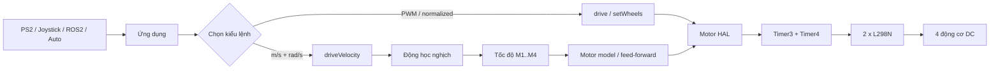

<div align="center">

# 🤖 TungLam_OmniMecanum_4WD

### Thư viện điều khiển đế robot Mecanum / Omni 4 bánh cho Arduino Mega 2560

<p>
  <a href="README.md">🇻🇳 Tiếng Việt</a>
  •
  <a href="README.en.md">🌐 English</a>
</p>

<p>
  <a href="https://github.com/Tunglam0605/TungLam-OmniMecanum-4WD/actions/workflows/compile-mega.yml">
    
  </a>
  <a href="https://github.com/Tunglam0605/TungLam-OmniMecanum-4WD/actions/workflows/arduino-lint.yml">
    
  </a>
  <a href="https://github.com/Tunglam0605/TungLam-OmniMecanum-4WD/actions/workflows/legacy-roboball-regression.yml">
    
  </a>
</p>

<p>
  
  
  
  
</p>

**Tác giả:** Nguyễn Khắc Tùng Lâm • **Lớp:** DHTD16A2CL • **Tung Lâm Automation**

Thư viện điều khiển đế robot 4 bánh đa hướng, hướng tới cả **người mới**, **học sinh/sinh viên**, và các bài toán robotics nâng cao hơn với động học `vx, vy, wz`, đơn vị SI, ABS, PID/IMU/encoder trong tương lai.

</div>

---

# 🇻🇳 Bắt đầu nhanh

Nếu bạn mới sử dụng thư viện, nên làm theo đúng thứ tự:

1. Cài thư viện từ Arduino Library Manager.
2. Đấu dây Arduino Mega → 2× L298N → 4 động cơ.
3. Kê robot lên để 4 bánh không chạm sàn.
4. Chạy ví dụ **FirstMotorTest**.
5. Xác nhận đúng M1, M2, M3, M4 và đúng chiều quay.
6. Chọn `MecanumX` hoặc `OmniX`.
7. Test tiến/lùi/ngang/quay.
8. Sau khi phần cứng đúng mới dùng `drive()`, `driveVelocity()` và ABS.

---

# ✨ Thư viện hiện hỗ trợ gì?

- ✅ Arduino Mega 2560 / ATmega2560
- ✅ 4 động cơ DC qua **2× L298N**
- ✅ Mecanum-X
- ✅ Omni X-drive
- ✅ Điều khiển từng bánh `M1..M4`
- ✅ Điều khiển normalized `-255..255`
- ✅ Hệ tọa độ robot tay phải: `+X tiến, +Y trái, +Z quay CCW`
- ✅ Điều khiển SI: `vx, vy` theo m/s và `wz` theo rad/s
- ✅ Khai báo điện áp động cơ, RPM, bán kính bánh, wheelbase, track width
- ✅ Inverse kinematics: `vx,vy,wz → tốc độ 4 bánh`
- ✅ Forward kinematics: `tốc độ 4 bánh → vx,vy,wz`
- ✅ Ước lượng RPM/tốc độ lý thuyết
- ✅ Giới hạn tốc độ bằng cách scale đồng đều 4 bánh
- ✅ PWM phần cứng Timer3 + Timer4
- ✅ Dead-time khi đảo chiều
- ✅ Đảo chiều riêng từng motor
- ✅ Coast stop
- ✅ Dynamic brake
- ✅ Active reverse brake / ABS
- ✅ ABS tự cắt bằng Timer3 ISR
- ✅ Giữ tương thích API V5 cũ
- ✅ Ví dụ có comment chi tiết bằng tiếng Việt
- ✅ Tài liệu động học riêng cho sinh viên

---

# 🧠 Kiến trúc thư viện



---

# 🔌 Sơ đồ bánh xe và chân nối

## Thứ tự bánh

```text
                     ĐẦU XE / FRONT
                           +X
                            ↑

              M1                         M3
         TRƯỚC-TRÁI                  TRƯỚC-PHẢI
            PWM D5                     PWM D7

              M2                         M4
          SAU-TRÁI                    SAU-PHẢI
            PWM D6                     PWM D8

                            ↓
                     ĐUÔI XE / REAR
```

## Chân PWM / EN

| Motor | Arduino Mega | AVR | L298N |
|---|---:|---|---|
| M1 | D5 | PE3 / OC3A | L298N #1 ENA |
| M2 | D6 | PH3 / OC4A | L298N #1 ENB |
| M3 | D7 | PH4 / OC4B | L298N #2 ENA |
| M4 | D8 | PH5 / OC4C | L298N #2 ENB |

## Chân chiều

| Motor | Tiến (+) | Lùi (-) |
|---|---:|---:|
| M1 | D30 / PC7 | D31 / PC6 |
| M2 | D32 / PC5 | D33 / PC4 |
| M3 | D34 / PC3 | D35 / PC2 |
| M4 | **D37 / PC0** | **D36 / PC1** |

> ⚠️ M4 được quy ước **D37 là tiến, D36 là lùi**.

## Mass chung

```text
GND Arduino Mega
      │
      ├──── GND L298N #1
      ├──── GND L298N #2
      └──── âm nguồn động cơ
```

> Không cấp nguồn cho 4 động cơ từ chân 5V của Arduino.

Tài liệu chi tiết: **[extras/WIRING.md](extras/WIRING.md)**

---

# 📦 Cài đặt từ Arduino IDE

Vào:

```text
Sketch
→ Include Library
→ Manage Libraries...
```

Tìm:

```text
TungLam_OmniMecanum_4WD
```

Sau đó chọn phiên bản mới nhất và nhấn **Install**.

---

# 💡 Gợi ý hàm bằng tiếng Việt trong Arduino IDE

Thư viện được viết để học sinh có thể **gõ code và học ngay từ phần gợi ý của IDE**.

Với Arduino IDE 2.x, sau khi tạo:

```cpp
TungLamDrive4WD robot;
```

hãy thử gõ:

```cpp
robot.
```

IDE sẽ gợi ý các hàm public như:

```text
forward(...)
backward(...)
drive(...)
driveVelocity(...)
setWheels(...)
ABS(...)
inverseKinematics(...)
...
```

Các hàm trong header chính đều có **Doxygen comment tiếng Việt** ngay trước declaration. Khi chọn hàm, xem signature help hoặc hover lên tên hàm, bạn có thể thấy mô tả kiểu:

```cpp
robot.driveVelocity(0.40f, 0.10f, 0.50f);
```

Ý nghĩa được ghi ngay trong API:

```text
vxMps   : vận tốc X [m/s], dương = tiến
vyMps   : vận tốc Y [m/s], dương = trái
wzRadps : tốc độ quay Z [rad/s], dương = CCW/trái

Nếu yêu cầu vượt khả năng model:
→ thư viện tự scale tốc độ 4 bánh để giữ tỷ lệ động học.
```

Ví dụ với:

```cpp
robot.setMotorInverted(3, true);
```

IDE có thể đọc từ header:

```text
Đảo chiều logic riêng một motor mà không sửa phương trình động học.

wheel:
1 = M1 trước-trái
2 = M2 sau-trái
3 = M3 trước-phải
4 = M4 sau-phải

inverted:
true  = đảo chiều
false = chiều mặc định
```

> `keywords.txt` chủ yếu dùng cho tô màu cú pháp. Phần giải thích hàm/parameter được đặt trong Doxygen comment của `src/TungLam_OmniMecanum_4WD.h` để Arduino Language Server có thể đọc khi code completion/hover.

Nếu vừa cập nhật thư viện nhưng IDE chưa hiện mô tả mới, hãy đóng/mở lại sketch hoặc khởi động lại Arduino IDE để language server index lại header.

---

# 🧪 Bài test đầu tiên: FirstMotorTest

Mở:

```text
File
→ Examples
→ TungLam_OmniMecanum_4WD
→ FirstMotorTest
```

Ví dụ sẽ chạy lần lượt:

```text
M1 tiến → M1 lùi
M2 tiến → M2 lùi
M3 tiến → M3 lùi
M4 tiến → M4 lùi
```

Nếu một động cơ quay ngược logic:

```cpp
robot.setMotorInverted(3, true);
```

Nên sửa bằng `setMotorInverted()` thay vì sửa bừa phương trình động học.

---

# 🚀 Dùng API hiện đại

```cpp
#include <TungLam_OmniMecanum_4WD.h>

TungLamDrive4WD robot;

void setup() {
  robot.begin(TungLamPwmMode::High7k8Hz);
  robot.setChassis(TungLamChassis::MecanumX);
}

void loop() {
  robot.forward(150);
}
```

---

# 🎮 Các lệnh cơ bản

```cpp
robot.forward(150);       // tiến
robot.backward(150);      // lùi

robot.strafeLeft(150);    // ngang trái
robot.strafeRight(150);   // ngang phải

robot.rotateLeft(120);    // quay trái / CCW
robot.rotateRight(120);   // quay phải / CW

robot.stop();             // dừng kiểu coast
```

---

# 🧭 Hệ tọa độ chuẩn của API modern

```text
                 +X / +vx
                    ↑
                    |
        +Y / +vy ← ROBOT

+Z hướng lên khỏi mặt robot

+wz = quay trái / CCW
-wz = quay phải / CW
```

Tức là:

```text
+vx = tiến
-vx = lùi

+vy = trái
-vy = phải

+wz = quay trái / CCW
-wz = quay phải / CW
```

> Từ v0.9.0 trở đi, modern Cartesian API dùng convention này. Các hàm tên rõ nghĩa như `strafeRight()`, `rotateRight()` vẫn giữ đúng hướng vật lý.

---

# 🎯 Điều khiển normalized với vx, vy, wz

```cpp
robot.drive(vx, vy, wz);
```

Ví dụ:

```cpp
robot.drive(160, 0, 0);      // tiến
robot.drive(0, 160, 0);      // ngang trái
robot.drive(0, 0, 120);      // quay trái / CCW
robot.drive(150, -100, 0);   // tiến-phải
```

Với Mecanum-X:

> Thứ tự bánh nhìn từ trên: **M1 trước-trái → M3 trước-phải → M4 sau-phải → M2 sau-trái** (theo chiều kim đồng hồ: **1 → 3 → 4 → 2**).

| Chuyển động | M1 | M2 | M3 | M4 |
|---|---:|---:|---:|---:|
| +vx tiến | + | + | + | + |
| -vx lùi | - | - | - | - |
| +vy trái | - | + | + | - |
| -vy phải | + | - | - | + |
| +wz CCW | - | - | + | + |
| -wz CW | + | + | - | - |

---

# 📐 Khai báo động cơ và kích thước đế

Đây là phần dành cho học sinh/sinh viên muốn tiếp cận đúng động học vật lý.

```cpp
TungLamDriveConfig model(
    12.0f,   // điện áp định mức động cơ [V]
    300.0f,  // RPM đầu ra hộp số ở điện áp định mức
    12.0f,   // điện áp nguồn cấp cho driver [V]
    0.050f,  // bán kính bánh [m]
    0.320f,  // khoảng cách tâm bánh trước - sau [m]
    0.280f,  // khoảng cách tâm bánh trái - phải [m]
    0.85f    // hệ số hiệu chỉnh vòng hở
);

robot.setDriveConfig(model);
```

Giải thích:

```text
motorNominalVoltageV  = điện áp danh định của motor
motorNoLoadRpm        = RPM đầu ra hộp số tại điện áp danh định
supplyVoltageV        = điện áp thực cấp cho driver
wheelRadiusM          = bán kính lăn của bánh
wheelbaseM            = tâm bánh trước tới tâm bánh sau
trackWidthM           = tâm bánh trái tới tâm bánh phải
speedScale            = hệ số hiệu chỉnh thực nghiệm
```

---

# 📏 Điều khiển theo m/s và rad/s

Sau khi đã khai báo model:

```cpp
robot.driveVelocity(
    0.40f,  // vx: tiến 0.40 m/s
    0.10f,  // vy: sang trái 0.10 m/s
    0.50f   // wz: quay CCW 0.50 rad/s
);
```

Luồng xử lý:

```text
vx, vy, wz
   ↓
động học nghịch
   ↓
vận tốc M1..M4 [m/s]
   ↓
giới hạn theo khả năng bánh
   ↓
motor model
   ↓
PWM vòng hở
   ↓
Motor HAL
```

> ⚠️ Không có encoder thì đây vẫn là **feed-forward vòng hở**. Thư viện chỉ ước lượng PWM theo model; không thể đảm bảo vận tốc đo thực tế chính xác tuyệt đối.

---

# 🧠 Chế độ Smart Safety — để thư viện tự lo phần khó

Với project học sinh/sinh viên, cấu hình một lần trong `setup()`:

```cpp
robot.enableSmartSafety(
    500,   // mất lệnh 500 ms -> tự dừng
    1.0f,  // giới hạn thay đổi vx/vy: 1.0 m/s²
    2.0f   // giới hạn thay đổi wz: 2.0 rad/s²
);
```

Sau đó trong `loop()` chỉ cần:

```cpp
robot.update();
robot.driveVelocity(vx, vy, wz);
```

Thư viện tự xử lý:

```text
lệnh vx,vy,wz
    ↓
soft-start / giới hạn tăng giảm tốc
    ↓
inverse kinematics
    ↓
tốc độ từng bánh
    ↓
kiểm tra vượt khả năng motor
    ↓
scale đồng đều nếu cần
    ↓
cache motor model -> PWM
    ↓
safe direction + dead-time
    ↓
L298N + motor

nếu mất lệnh quá timeout
    ↓
watchdog tự stop
```

Các phép chia float nặng của motor model/geometry được **tính trước và cache khi gọi `setDriveConfig()`**, nên vòng `driveVelocity()` chạy nhẹ hơn trên ATmega2560.

Nếu muốn biết lệnh vừa bị giới hạn:

```cpp
if (robot.wasVelocityLimited()) {
  float scale = robot.lastVelocityScale();
}
```

Ví dụ `scale = 0.60` nghĩa là vector tốc độ được giảm đồng đều còn khoảng 60% để không vượt khả năng bánh.

> Watchdog cần `robot.update()` được gọi liên tục trong `loop()`. Mặc định Smart Safety **không tự bật**, nên code cũ vẫn giữ hành vi như trước.

---

# 🚧 Nếu yêu cầu vận tốc quá lớn thì sao?

Thư viện xử lý ở tầng **vận tốc bánh**, không clamp riêng từng `vx`, `vy`, `wz`.

Ví dụ động học tính ra:

```text
M1 = 1.20 m/s
M2 = 0.80 m/s
M3 = 1.50 m/s
M4 = 1.10 m/s
```

nhưng bánh chỉ đạt tối đa:

```text
1.00 m/s
```

thì toàn bộ vector sẽ được scale:

```text
scale = 1.00 / 1.50
```

rồi nhân cho cả 4 bánh.

Cách này giữ đúng tỷ lệ chuyển động và hạn chế méo hướng.

---

# 🧮 Inverse kinematics

```cpp
TungLamWheelVelocity wheels =
    robot.inverseKinematics(
        0.40f,
        0.10f,
        0.50f
    );
```

Kết quả:

```cpp
wheels.m1Mps;
wheels.m2Mps;
wheels.m3Mps;
wheels.m4Mps;
```

---

# 🔁 Forward kinematics

```cpp
TungLamBodyVelocity body =
    robot.forwardKinematics(wheels);
```

Kết quả:

```cpp
body.vxMps;
body.vyMps;
body.wzRadps;
```

Đây là phần rất hữu ích cho encoder, odometry và ROS2 sau này.

Tài liệu toán chi tiết: **[extras/KINEMATICS.md](extras/KINEMATICS.md)**

---

# ⚙️ Các giá trị lý thuyết có thể đọc từ model

```cpp
robot.estimatedMotorRpmAtSupply();
robot.maxWheelLinearSpeedMps();
robot.maxBodyLinearSpeedMps();
robot.maxYawRateRadps();
```

---

# 🛑 Các chế độ dừng / hãm

## Coast

```cpp
robot.stop();
```

PWM về 0.

## Dynamic brake

```cpp
robot.dynamicBrake();
```

Dùng trạng thái điện của H-bridge để ghìm motor.

## Active reverse brake / ABS

```cpp
robot.ABS(180);
```

Thư viện tạo mô-men ngược trong khoảng thời gian ngắn rồi Timer3 ISR tự ngắt.

Có thể chỉnh bảng thời gian:

```cpp
robot.setTimABS(45, 65, 70, 75, 80, 85);
```

> ⚠️ ABS có thể tạo dòng lớn và gây nóng L298N, sụt áp pin, trượt bánh hoặc sốc cơ khí. Cần tune thực tế.

---

# 🧱 API V5 cũ vẫn dùng được

```cpp
#include <TungLam_Control_MotorV5.h>

TungLam_Control_MotorV5 robot;
```

Các hàm cũ như:

```cpp
robot.Tien(...);
robot.Lui(...);
robot.Phai(...);
robot.Trai(...);
robot.N_Phai(...);
robot.N_Trai(...);
robot.ABS(...);
robot.setTimABS(...);
```

vẫn được giữ để project cũ không phải viết lại.

---

# 🎮 Tích hợp tay cầm PS2

Thư viện đế **không phụ thuộc cứng** vào tay cầm. PS2 vẫn là một input layer độc lập:

```text
PS2 controller
      ↓
TungLam_PS2
      ↓
joystick / button state đã lọc
      ↓
application mapping
      ↓
vx, vy, wz
      ↓
TungLam_OmniMecanum_4WD
      ↓
4 motor
```

Ví dụ đầy đủ nằm tại **`examples/PS2RobotControl`** và dùng `TungLam_PS2 v0.4.0`.

Trên Arduino Mega 2560, hai thư viện không xung đột chân mặc định:

| Khối | Chân |
|---|---|
| PS2 SPI | D50 MISO, D51 MOSI, D52 SCK, ví dụ D53 CS |
| Motor PWM | D5, D6, D7, D8 |
| Motor DIR | D30..D37 |

Mapping trong example:

- joystick trái → tiến/lùi/ngang;
- joystick phải trái/phải → quay;
- giữ L1 → slow;
- giữ R1 → fast;
- nhấn START → bật/tắt quyền điều khiển;
- mất PS2 → `robot.stop()` ngay;
- debug tùy chọn bằng `ps2.debug(Serial)`, không spam khi state đứng yên.

Mapping trên **chỉ thuộc example**. Core motor vẫn dùng được với Bluetooth, ESP-NOW, RC, ROS2, tự hành, camera/vision hoặc bất kỳ nguồn lệnh nào khác.

---

# 🧩 Ví dụ đi kèm

| Ví dụ | Mục đích |
|---|---|
| **FirstMotorTest** | Kiểm tra M1..M4 và chiều quay |
| **BasicMotion** | Chuyển động cơ bản kiểu V5 |
| **MecanumDrive** | Dùng modern Mecanum |
| **OmniXDrive** | Dùng Omni X-drive |
| **PerWheelControl** | Điều khiển trực tiếp từng bánh |
| **MetricKinematics** | Khai báo motor/chassis, m/s, rad/s, IK/FK |
| **StudentQuickStart** | Ví dụ khuyến nghị: Smart Safety + driveVelocity() tối giản |
| **PS2RobotControl** | Điều khiển đế bằng TungLam_PS2: joystick trái/phải, speed button, fail-safe |
| **ActiveBrake** | ABS |
| **ActiveBrakeNonBlocking** | ABS không block chương trình |
| **LegacyV5DropIn** | Giữ nguyên code V5 |
| **LegacyApiNewHeader** | Dùng V5 qua header mới |
| **LegacyApiSurface** | Kiểm tra toàn bộ API legacy |

Mặc định các ví dụ trong `examples/` dùng **comment tiếng Việt**.

Bản comment tiếng Anh được lưu tại:

```text
extras/examples-en/
```

---

# 🔮 Hướng mở rộng đã chuẩn bị sẵn

## Encoder velocity PID

```text
vx,vy,wz target
      ↓
inverse kinematics
      ↓
wheel speed target
      ↓
PID từng bánh ← encoder
      ↓
PWM
```

## IMU giữ hướng

```text
yaw target
   ↓
IMU yaw
   ↓
heading PID
   ↓
wz correction [rad/s]
   ↓
driveVelocity(vx, vy, wz)
```

## ROS2

Có thể map trực tiếp:

```text
cmd_vel.linear.x  → vx [m/s]
cmd_vel.linear.y  → vy [m/s]
cmd_vel.angular.z → wz [rad/s]
```

---

# ⚠️ Tài nguyên phần cứng thư viện sử dụng

```text
Timer3 → M1 PWM + ABS timing
Timer4 → M2/M3/M4 PWM
PORTC  → D30..D37 direction
```

Không nên để thư viện khác cấu hình lại Timer3/Timer4 cùng lúc.

---

# 🧾 API help coverage

Từ v0.9.2, public API được audit đầy đủ:

```text
Legacy V5   : 29/29 hàm có mô tả tiếng Việt
Modern API  : 46/46 hàm có mô tả tiếng Việt
Tổng        : 75/75

@brief  : đầy đủ
@param  : đầy đủ cho mọi hàm có tham số
@return : đầy đủ cho mọi hàm có giá trị trả về
```

Mục tiêu là khi học sinh/sinh viên gõ code trong Arduino IDE 2.x, phần completion/hover/signature help có đủ ngữ cảnh để hiểu hàm đang làm gì và từng tham số có ý nghĩa gì.

---

# ✅ Kiểm thử CI

Mỗi thay đổi được kiểm tra bằng:

```text
Arduino Mega compile
Arduino Lint
RoboBall 2024 legacy regression
```

Legacy RoboBall hiện vẫn được dùng làm regression để tránh phá project cũ.

---

# 📚 Tài liệu

- 🇻🇳 **[README tiếng Việt](README.md)**
- 🌐 **[README English](README.en.md)**
- 🇻🇳 **[Đấu nối phần cứng](extras/WIRING.md)**
- 🌐 **[Wiring guide English](extras/WIRING.en.md)**
- 🇻🇳 **[Động học và SI velocity](extras/KINEMATICS.md)**
- 🌐 **[Kinematics English](extras/KINEMATICS.en.md)**
- **[CHANGELOG](CHANGELOG.md)**

---

<div align="center">

## 👨‍💻 Nguyễn Khắc Tùng Lâm

DHTD16A2CL
**Tung Lâm Automation**

Thư viện được phát triển từ bộ điều khiển V5 đã dùng cho robot thực tế, sau đó mở rộng thành nền tảng drive-base cho Mecanum/Omni, học tập động học và các bài toán robotics nâng cao.

</div>
